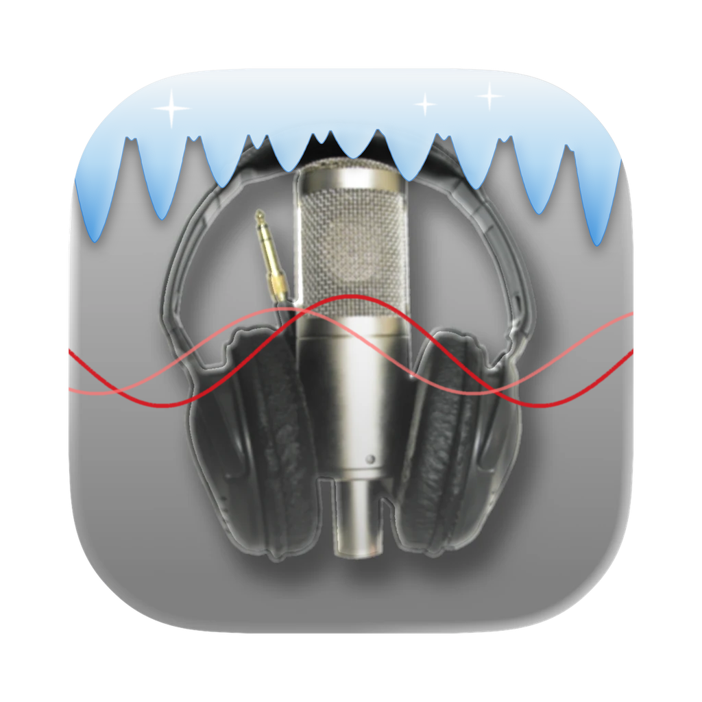

<p align="center"></p>

# iceKast

**Version 1.0b1 (beta)**

A free macOS app that makes running an [Icecast](https://icecast.org) streaming server easy.
Built for Radiologik users, but works with any encoder (BUTT, Audio Hijack, LadioCast…).
Icecast is bundled; nothing else needs to be installed. MP3, AAC and HE-AAC streams.

- One Icecast server with any number of mounts; per-mount max listeners, burst size, fallback and stream info
- Live status per mount, with listener counts in the Dock badge and the menu bar
- The server runs in the background: it keeps running when iceKast is closed, restarts if it stops, and starts at login
- Copy-and-paste connection details for your encoder
- macOS 13 or later, Apple silicon and Intel

## Building

Requires Xcode, and `xcodegen` (`brew install xcodegen`) to generate the project.

```bash
scripts/build-icecast.sh     # builds the universal static Icecast into build/icecast
xcodegen generate            # creates iceKast.xcodeproj from project.yml
xcodebuild -project iceKast.xcodeproj -scheme iceKast -derivedDataPath build/xcode build
xcodebuild -project iceKast.xcodeproj -scheme iceKast -derivedDataPath build/xcode test
```

## Versioning

The public version is `1.0b1` (`CFBundleShortVersionString`). The internal build number is
`1.0.0.2.1` (`CFBundleVersion`). Both are set in `project.yml`.

## License

The source code is GPLv2, same as Icecast. See [LICENSE](LICENSE).

The iceKast icon is derived from the Radiologik icon and is © MacinMind Software, Inc. All rights
reserved. It is **not** covered by the GPL; please don't reuse it without permission.
