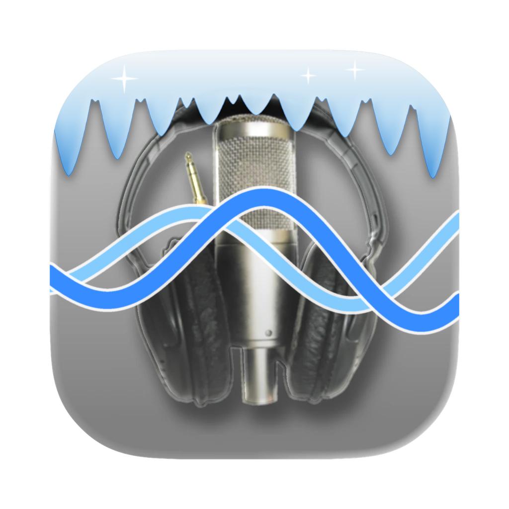

<p align="center"></p>

# LogiKast

**Version 1.0b2 (beta)**

*LogiKast was called iceKast in its first beta.*

A free macOS app that makes running an [Icecast](https://icecast.org) streaming server easy.
Built for Radiologik users, but works with any Icecast-compatible encoder, such as [Audio Hijack](https://rogueamoeba.com/audiohijack/), [LadioCast](https://apps.apple.com/us/app/ladiocast/id411213048), [BUTT](https://danielnoethen.de/butt/) and [BUTTM](https://buttm.app).
Icecast is bundled; nothing else needs to be installed. MP3, AAC and HE-AAC streams.

- One Icecast server with any number of mounts; per-mount max listeners, burst size, fallback and stream info
- Live status per mount, with listener counts in the Dock badge and the menu bar
- The server runs in the background: it keeps running when LogiKast is closed, restarts if it stops, and starts at login
- Copy-and-paste connection details for your encoder, and a setup assistant for new stations
- Listener list with search and a Disconnect button, per-stream and total bandwidth, and a button for Icecast's web admin
- Backup audio file that plays when the encoder drops and hands back to live when it returns
- Share links, QR code and website player code; optional public directory listing
- macOS 13 or later, Apple silicon and Intel

## Building

Requires Xcode, and `xcodegen` (`brew install xcodegen`) to generate the project.

```bash
scripts/build-icecast.sh     # builds the universal static Icecast into build/icecast
xcodegen generate            # creates LogiKast.xcodeproj from project.yml
xcodebuild -project LogiKast.xcodeproj -scheme LogiKast -derivedDataPath build/xcode build
xcodebuild -project LogiKast.xcodeproj -scheme LogiKast -derivedDataPath build/xcode test
```

## Versioning

The public version is `1.0b2` (`CFBundleShortVersionString`). The internal build number is
`1.0.0.7.2` (`CFBundleVersion`). Both are set in `project.yml`.

## License

The source code is GPLv2, same as Icecast. See [LICENSE](LICENSE).

The LogiKast icon is derived from the Radiologik icon and is © MacinMind Software, Inc. All rights
reserved. It is **not** covered by the GPL; please don't reuse it without permission.
